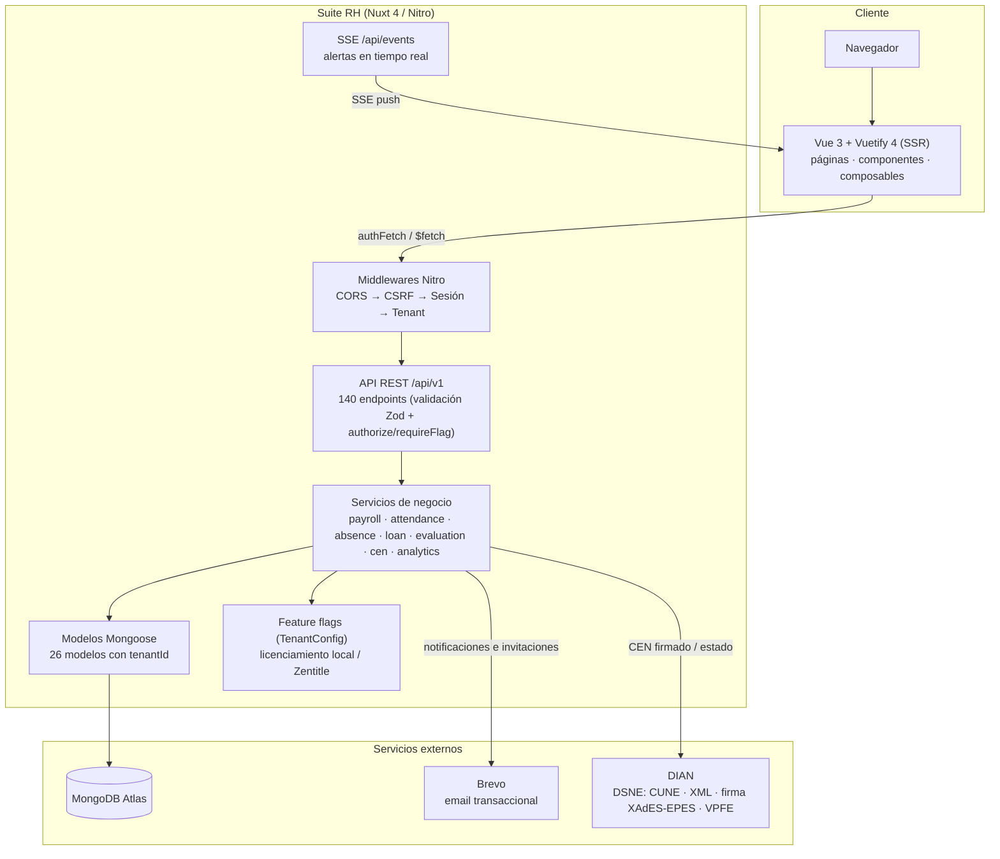
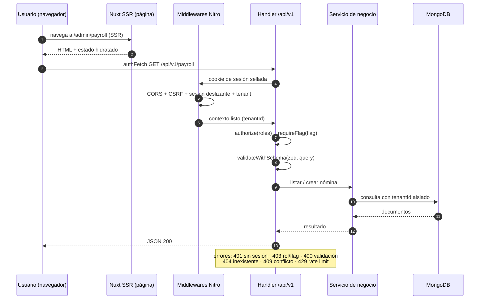
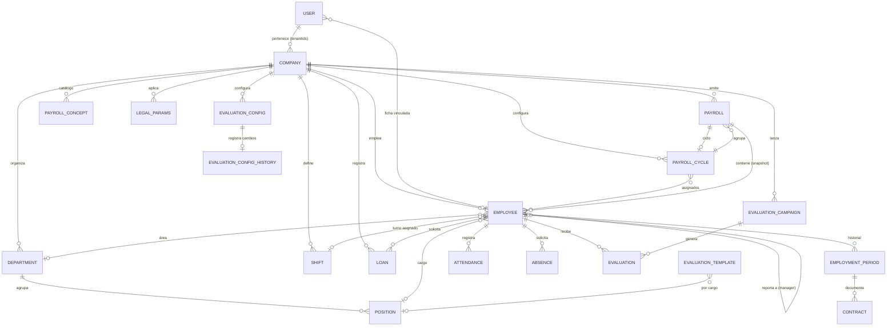

# Arquitectura Técnica — Suite RH (HRMS)

> Documento de referencia técnica para desarrolladores y arquitectos.
> Describe cómo está construida la plataforma: frontend, backend, API,
> modelos de datos, autenticación, validaciones, módulos de negocio,
> integración DIAN, seguridad y pruebas.

**Última actualización:** 2026-09-01

---

## 1. Resumen ejecutivo

Suite RH es un sistema de gestión de recursos humanos (HRMS) colombiano,
construido como una aplicación **monolítica full-stack** sobre Nuxt 4
(Nitro + Vue 3) con MongoDB/Mongoose. El frontend y el backend viven en el
mismo repositorio: las páginas y componentes Vue en `app/`, y la API REST
en `server/`. La aplicación se ejecuta con renderizado SSR (universal) y
consume su propia API, aunque esta última es invocable de forma independiente.

La plataforma cubre los procesos centrales de RRHH: organización (áreas y
cargos), empleados con historial de vinculación, turnos, asistencia con
validación de horas extras y tardanzas, ausencias e incapacidades, préstamos,
nómina con ciclos de pago y conceptos configurables, evaluación de desempeño
por campañas, contratos, analítica/dashboard y portal de autoservicio del
empleado. Incluye además la generación del **Documento Soporte de Pago de
Nómina Electrónica (DSNE)** ante la DIAN: XML con CUNE, SoftwareSC, código
QR y firma digital XAdES-EPES.

---

## 2. Stack tecnológico

| Capa | Tecnología | Propósito |
|---|---|---|
| Framework | Nuxt 4 (SSR/universal) | Aplicación completa (frontend + API en un solo deploy) |
| Backend | Nitro (server engine de Nuxt) | API REST, middlewares, eventos, SSE |
| Frontend | Vue 3 (`<script setup>` + Composition API) | UI reactiva |
| UI Kit | Vuetify 4 (MD3) | Componentes, temas claro/oscuro, densidad |
| Gráficos | ECharts 6 + vue-echarts 8 | Dashboards y reportes |
| Base de datos | MongoDB + Mongoose 9 | Persistencia (esquemas embebidos, referencias) |
| Validación | Zod 4 | Schemas compartidos cliente/servidor, validación estricta en la API |
| Autenticación | nuxt-auth-utils | Sesión sellada en cookie httpOnly, SSR-friendly |
| Hash de contraseñas | bcrypt (cost 10) | Seguridad de credenciales |
| Criptografía | node:crypto, node-forge, xadesjs, xmldsigjs | CUNE, cifrado de secretos, firma XAdES-EPES |
| Correo | Brevo (API transaccional + webhooks) | Invitaciones, notificaciones, seguimiento de entregas |
| Tests | Vitest 4 | Pruebas unitarias de server y helpers compartidos |
| Empaquetado | pnpm 11 | Gestión de dependencias (monorepo estricto) |

---

## 3. Estructura del repositorio

```
nomina-app-01/
├── app/                      # Frontend (Nuxt)
│   ├── assets/css/           # Estilos globales
│   ├── components/           # Componentes Vue reutilizables por módulo
│   ├── composables/          # Lógica reutilizable + estado global (useState)
│   │   └── states/           # Estados por dominio (auth, payroll, company…)
│   ├── data/                 # Contenido estático (help center, módulos landing)
│   ├── layouts/              # default (app), login, landing
│   ├── middleware/           # Guards de ruta (auth, not-authenticated)
│   ├── pages/                # Rutas: admin/*, portal, reports, auth, marketing
│   ├── plugins/              # echarts, vuetify
│   └── utils/                # api-paths, validation-rules, vuetifyDefaults
├── server/                   # Backend (Nitro)
│   ├── api/                  # Endpoints REST (140 archivos bajo /api/v1)
│   ├── assets/dian/          # XSD oficial DIAN, esquemas UBL, ejemplos
│   ├── middleware/           # cors, csrf, session, tenant
│   ├── models/               # 26 modelos Mongoose
│   ├── plugins/              # Conexión MongoDB al arranque
│   ├── routes/               # Rutas de autenticación OAuth (nuxt-auth-utils)
│   ├── services/             # Lógica de negocio por dominio
│   └── utils/                # authorize, tenant, validaciones, cune, emails…
├── shared/                   # Código compartido cliente+servidor
│   └── utils/                # helpers de fechas, asistencia, nómina
├── scripts/                  # Seeders de datos de demostración
├── tests/                    # Tests de helpers compartidos + setup Vitest
├── docs/                     # Documentación (propuestas, DIAN, arquitectura)
└── nuxt.config.ts            # Configuración de la app + runtimeConfig
```

### Convención de capas

El proyecto separa **tres capas en el servidor**:

1. **Rutas de API** (`server/api/v1/.../*.ts`): validan entrada (Zod),
   autorizan (roles + feature flags), orquestan el servicio y devuelven la
   respuesta HTTP. No contienen lógica de negocio.
2. **Servicios** (`server/services/*.ts`): concentran la lógica de negocio
   (cálculos de nómina, asistencia, campañas, CEN…). Son funciones puras o
   con acceso a modelos, independientes de la capa HTTP.
3. **Modelos** (`server/models/*.ts`): esquemas Mongoose con validación a
   nivel de base de datos, índices y hooks (p. ej. hash de contraseña).

Los **utils** de `server/utils/` son transversales: autenticación,
multi-tenant, validación, auditoría, email, límites de petición y
criptografía DIAN.

---

## 4. Arquitectura de alto nivel

### Flujo de una petición

```
Navegador / cliente
   │  HTTPS
   ▼
Middlewares Nitro (por orden):
   1. cors.ts          → solo /api/**, allowlist CORS_ORIGINS
   2. csrf.ts          → mutaciones con Origin ≠ host → 403
   3. session.ts       → sesión deslizante (renueva cookie máx. 1/hora)
   4. tenant.ts        → contexto del tenant activo por petición
   ▼
Handler de ruta (server/api/v1/...)
   ├─ requireFlag / authorize (roles + feature flags + tenant)
   ├─ validateWithSchema(zodSchema, body/query)
   ├─ servicio de negocio (server/services/*)
   └─ respuesta JSON / XML / binario (ZIP, Excel, PDF)
```

### 4.1. Diagrama de arquitectura (alto nivel)



### 4.2. Secuencia de una petición API



### SSR y estado

- Nuxt renderiza SSR; los layouts y páginas evitan hidratación problemática
  usando `<ClientOnly>` donde Vuetify puede diferir entre servidor y cliente.
- El estado global usa `useState` de Nuxt (sin Pinia): cada dominio expone un
  composable de estado (`usePayrollState`, `useAttendanceState`, …) que
  centraliza `fetch`, `loading`, `error` y acciones, e invoca la API con
  `authFetch` (reintento automático ante 401).
- Preferencias de UI (tema claro/oscuro, densidad, vista tabla/tarjetas) se
  persisten en `localStorage` y se aplican antes de la hidratación para
  evitar parpadeos (ver `nuxt.config.ts` script inline y `useTheme`).

---

## 5. Frontend

### 5.1. App shell y layouts

- `app/app.vue`: raíz con `<VApp>`, `<NuxtLayout>`, título de pestaña
  ("… · Suite RH"), favicon propio y snackbar global.
- `app/layouts/default.vue`: AppBar + NavDrawer (cliente) + `<v-main>` +
  diálogo de ayuda global. El drawer se monta en `<ClientOnly>` para evitar
  mismatches de hidratación de Vuetify.
- `app/layouts/login.vue` / `landing.vue`: layouts minimalistas para
  autenticación y páginas públicas.

### 5.2. Rutas y protección

| Ruta | Acceso | Middleware |
|---|---|---|
| `/auth/login`, `/auth/invite` | Público (solo no autenticado) | `not-authenticated` |
| `/home`, `/profile`, `/admin/**`, `/reports`, `/portal` | Autenticado | `auth` |
| `/` y marketing (`/precios`, `/contacto`, `/modulos/…`) | Público | — |

- El middleware `auth` redirige a `/auth/login?redirect=…` si no hay sesión.
- Las páginas de módulos llaman `useModuleGuard()` (o `requireFlag` en API):
  si el feature flag del módulo está apagado para el tenant, redirige a
  `/home` y la API responde 403.
- El drawer (`NavDrawer`) muestra solo lo que el rol puede ver y respeta los
  flags activos.

### 5.3. Componentes reutilizables

Los componentes comunes viven en `app/components/common/`:

- `ListToolbar.vue`: barra de herramientas reutilizable con título, buscador,
  filtros y conmutador de vista tabla/tarjetas (derecha). Es el toolbar
  estándar de las listas del sistema.
- `PageHeader.vue`: encabezado de página con título, subtítulo y acciones.
- `DataCards.vue`: vista de tarjetas genérica para listas.
- `ConfigurationTabs.vue`: pestañas de configuración (empresa, legal,
  conceptos, ciclos, flags, alertas, evaluaciones).
- `ModulePlaceholder.vue`: módulos futuros.
- `AppSnackbar.vue`: notificaciones globales (estado `useSnackbarState`).

Cada módulo aporta sus componentes específicos (`employees/Table.vue`,
`attendance/FormDialog.vue`, `payroll/PayrollFormDialog.vue`, …).

### 5.4. Composables y estado

| Composable | Función |
|---|---|
| `useAuthState` | Sesión, `authFetch` (retry 401), login/logout, `fetchMe` |
| `useTheme` / `useDensity` / `useViewMode` | Preferencias de UI persistidas |
| `useModuleGuard` | Redirección por feature flag por ruta |
| `useHelp` | Centro de ayuda contextual (sección por ruta, diálogo global) |
| `useEmployeeState`, `useAttendanceState`, `usePayrollState`, `useAbsenceState`, `useShiftState`, `useLoanState`, `useUserState`, `useCompanyState`, `useLegalParamsState`, `useAnalyticsState`, `useEvaluationState`, `useFeatureFlagsState` | Estado + API por dominio |
| `usePayrollReceiptPdf` / `useEvaluationPdf` | Generación de PDF con pdfmake (recibo de nómina, evaluación) |

### 5.5. Centro de ayuda

El contenido vive en `app/data/help-sections.ts` (estructura similar a la del
proyecto Boston/bis-sw-01): secciones con bloques ricos (`title`,
`paragraph`, `list`, `steps`, `table`, `warning`), FAQ por sección,
relacionadas y visibilidad por **audiencia** (`todos`, `gestion`,
`empleado`) y por **feature flag**. `useHelp` mapea la ruta actual a una
sección (`getSectionForPath`) y el botón de ayuda del AppBar abre
`HelpDialog` con el contenido filtrado por rol/permisos.

### 5.6. Portal del empleado y landing

- `app/pages/portal.vue`: autoservicio del empleado (mi perfil, ausencias,
  recibos de nómina) protegido por flag `self_service`.
- `app/pages/index.vue` y marketing (`/modulos`, `/precios`, `/contacto`,
  `/seguridad`, `/faq`, `/implementacion`, …): sitio público con contenido
  en `app/data/modules.ts` (módulos con features, normativa laboral citada y
  capturas), formulario de contacto con honeypot + rate limit y páginas
  legales.

---

## 6. Backend y API

> El inventario completo de los 140 endpoints con método, ruta, acceso y
> descripción está en [docs/api-reference.md](api-reference.md).

### 6.1. Convenciones REST

- Base: `/api/v1` (constante `API_BASE` en `app/utils/api-paths.ts`).
- Métodos: `GET` listado/detalle, `POST` creación/acciones, `PUT`
  actualización, `DELETE` baja. Acciones de negocio como sub-rutas verbales:
  `/payroll/[id]/approve.put.ts`, `/attendance/[id]/approve.put.ts`,
  `/loans/[id]/payment.post.ts`.
- Nombres de archivo: `index.get.ts`, `[id].get.ts`, `[id].put.ts` (routing
  por archivo de Nitro).
- Respuestas: JSON por defecto; XML (CEN), ZIP (CEN masivo) y binarios
  (Excel, PDF, .p12) con `setHeader('content-disposition', …)`.
- Errores: `createError({ statusCode, message })`; 400 validación, 401 sin
  sesión, 403 sin rol/flag, 404 inexistente, 409 conflicto, 429 rate limit.

### 6.2. Middlewares

| Middleware | Detalle |
|---|---|
| `cors.ts` | CORS restrictivo solo para `/api/**` con allowlist `CORS_ORIGINS`; same-origin funciona sin cabeceras CORS. |
| `csrf.ts` | Mutaciones: si el navegador envía `Origin`, debe coincidir con `Host` (o `x-forwarded-host`) o estar en la allowlist; si no, 403. |
| `session.ts` | Sesión deslizante: renueva la cookie de sesión como máximo una vez por hora. |
| `tenant.ts` | Inyecta `event.context.tenantId` desde la sesión del usuario (multi-tenant) o la empresa global. |

### 6.3. Endpoints por dominio

**Auth y usuarios:** `POST /auth/login`, `POST /auth/logout`, `GET /auth/me`,
`PUT /auth/password`, `POST /auth/invite`, `GET/POST/PUT/DELETE /users[/id]`,
`POST /users/[id]/invite`.

**Empresa y legal:** `GET/PUT /company`, `GET /company/audit`,
`GET/POST /legal-params`, `POST /legal-params/[id]/activate`,
`GET /legal-params/historical`, `GET /company/cen-test-cert` (cert .p12 de
prueba).

**Empleados y organización:** `GET/POST /employees`, `GET/PUT/DELETE
/employees/[id]`, `POST /employees/[id]/rehire`, `PUT
/employees/[id]/turno`, `GET /employees/users-available`, `GET/POST /departments`,
`GET/POST/PUT/DELETE /positions`, `GET /employment-periods/[employeeId]`,
`GET/POST /contracts`, `PUT /contracts/[id]/renew`.

**Asistencia y turnos:** `GET/POST /attendance`, `GET/PUT/DELETE
/attendance/[id]`, `PUT /attendance/[id]/approve|reject|status`,
`GET /attendance/config`, `PUT /attendance/config`, `GET
/attendance/dashboard`, `GET /attendance/monthly/[employeeId]`, `GET
/attendance/weekly/[employeeId]`, `GET/POST /shifts`, `PUT/DELETE
/shifts/[id]`, `POST /shifts/[id]/assign|unassign`, `GET
/shifts/[id]/employees|history`, `GET /shifts/calendar` (vía página).

**Ausencias y préstamos:** `GET/POST /absences`, `GET/PUT/DELETE
/absences/[id]`, `PUT /absences/[id]/approve|reject`, `GET /absences/report`,
`GET/POST /loans`, `GET/PUT /loans/[id]`, `POST /loans/[id]/payment`.

**Nómina:** `GET/POST /payroll`, `GET/PUT /payroll/[id]`, `PUT
/payroll/[id]/approve|pay|cancel`, `POST /payroll/[id]/recalculate`, `GET
/payroll/[id]/employees|history`, `GET /payroll/[id]/cen`,
`GET /payroll/[id]/cen-all` (ZIP), `GET /payroll/[id]/nomina-export` (Excel),
`GET /payroll/dashboard`, `GET /payroll/employee/[employeeId]`, `GET/POST
/payroll-cycles`, `PUT/DELETE /payroll-cycles/[id]`, `POST
/payroll-cycles/[id]/assign|move`, `GET /payroll-cycles/[id]/candidates|employees`,
`GET/POST/PUT/DELETE /payroll-concepts[/id]`.

**Evaluaciones:** `GET/POST /evaluation-templates`, `PUT/DELETE
/evaluation-templates/[id]`, `GET /evaluation-templates/by-position/[positionId]`,
`GET/PUT /evaluation-config`, `GET /evaluation-config/history`, `GET/POST
/evaluation-campaigns`, `GET/PUT/DELETE /evaluation-campaigns/[id]`, `POST
/evaluation-campaigns/[id]/generate`, `GET /evaluation-campaigns/[id]/history`,
`GET/POST /evaluations`, `GET/PUT /evaluations/[id]`, `PUT
/evaluations/[id]/approve`.

**Analítica, flags, email y públicos:** `GET /analytics/overview`, `GET/PUT
/analytics/alert-config`, `GET /analytics/alerts`, `PUT
/analytics/alerts/[id]/read`, `GET/PUT /flags`, `GET /emails`, `POST
/emails/webhook` (Brevo), `GET /events` (SSE de alertas), `POST
/public/contact`, `GET /contact-messages`.

---

## 7. Autenticación y autorización

### 7.1. Sesión

- `nuxt-auth-utils` gestiona una sesión **sellada** (firmada/cifrada con
  `NUXT_SESSION_PASSWORD`) en cookie httpOnly. En el servidor,
  `requireUserSession(event)` la valida; en el cliente, `useUserSession()`
  expone `loggedIn` y `user` sin exponer la cookie.
- El login (`POST /auth/login`) valida credenciales con bcrypt contra el
  modelo `User` y crea la sesión.
- `useAuthState.fetchMe()` rehidrata el usuario desde la BD en cada carga
  (`GET /auth/me`), de modo que cambios de rol/estado surten efecto de
  inmediato (el guard de ruta y la API validan contra la BD, no contra la
  sesión).

### 7.2. Roles

Definidos en `shared/auth.ts`:

| Rol | Alcance típico |
|---|---|
| `admin` | Todo, incluida configuración y usuarios |
| `manager` | Gestión (sin configuración avanzada de usuarios) |
| `hr` | RRHH: empleados, asistencia, nómina, ausencias, evaluaciones |
| `employee` | Solo portal de autoservicio (`self_service`) |

### 7.3. Autorización en la API

- `authorize(event, roles)` → 401 sin sesión, 403 si el rol no está en la
  lista o el usuario está inactivo. **Consulta la BD en cada petición**.
- `requireFlag(event, roles, flag)` → autoriza por rol **y** verifica que el
  módulo esté habilitado para el tenant (feature flag).
- `isAdmin` / `isAdminOrManager` → comprobaciones booleanas sin lanzar error
  (usadas por el frontend o rutas con comportamiento variable).
- `app/middleware/auth.ts` protege rutas en el cliente; las páginas
  administrativas además filtran el menú por rol.

### 7.4. Invitaciones y contraseñas

- `POST /auth/invite` (admin) genera un token aleatorio de 32 bytes; solo se
  guarda su **hash SHA-256** (`inviteTokenHash`) con expiración a 72 h.
- `POST /users/[id]/invite` reenvía la invitación por email (Brevo).
- Las contraseñas se hashean con bcrypt (cost 10) en el hook `pre('save')`
  del modelo `User` solo cuando cambian.

### 7.5. Multi-tenant

El modelo `User` tiene `tenantIds[]` y `tenantActivo`; se sincronizan con las
fichas de empleado vinculadas (`Employee.user`) mediante
`syncUserTenants()` al crear/vincular empleados y al autenticar.

- `getTenantId(event)`: devuelve el tenant de la sesión; si no existe
  (usuario sin empresa), usa la empresa global activa (fallback de un solo
  tenant).
- `addTenantFilter(event, filter)`: añade `tenantId` a cualquier consulta
  para aislar datos por empresa.
- `requireFlag` valida el flag contra el `TenantConfig` del tenant.
- El frontend tiene `TenantSwitcher` (selector en el AppBar) y endpoints
  `GET /auth/tenants`, `PUT /auth/tenant`.

---

## 8. Validaciones

Toda entrada de la API pasa por **Zod** con `validateWithSchema(schema, data)`
(`server/utils/validation-schemas.ts`, ~550 líneas):

- Schemas por dominio: `loginSchema`, `userCreateSchema`, `companyUpdateSchema`,
  `legalParamsSchema`, `employeeCreateSchema`, `attendanceCreateSchema`,
  `absenceCreateSchema`, `loanCreateSchema`, `payrollConceptSchema`,
  `payrollCycleSchema`, `shiftCreateSchema`, `payrollCreateSchema`, entre otros.
- Fechas: `dateOnlySchema` normaliza `YYYY-MM-DD` a mediodía UTC (evita
  desfases de zona horaria) usando helpers de `shared/utils/datetime-helpers.ts`.
- Constantes DIAN: `DIAN_DOCUMENT_TYPES`, `DIAN_EMPLOYEE_TYPES`,
  `DIAN_SUB_EMPLOYEE_TYPES` restringen códigos del anexo técnico.
- `mongoIdSchema` valida ObjectId (24 hex).
- Fallo → `400 { message: 'Datos de entrada inválidos', data: flatten }`.

Los helpers compartidos de negocio (`shared/utils/attendance-helpers.ts`,
`datetime-helpers.ts`) se usan **tanto en el servidor como en los scripts de
seed**, garantizando consistencia entre producción y datos demo.

---

## 9. Modelos de datos

Modelos en `server/models/` (Mongoose, `{ timestamps: true, versionKey: false }`,
con índices compuestos para las consultas frecuentes). Todos los modelos de
negocio llevan `tenantId` para aislamiento multi-tenant.

| Modelo | Propósito | Relaciones clave |
|---|---|---|
| `User` | Usuario, rol, estado, invitaciones, tenants | → Employee (vía `user`) |
| `Company` | Configuración de la empresa (nombre, NIT, DIAN, jornada, certificado .p12 cifrado) | raíz del tenant |
| `TenantConfig` | Feature flags del tenant (licencia local) | → Company |
| `Employee` | Ficha del trabajador (documento, salario, contrato, turno, jefe, área) | → Company, User, Shift, Department, Employee (manager) |
| `Department` | Áreas de la organización | → Company, Position |
| `Position` | Cargos/funciones por área | → Department |
| `EmploymentPeriod` | Historial de vinculación (ingreso, retiro, reingreso) | → Employee |
| `Contract` | Contratos laborales por período de vinculación | → Employee, EmploymentPeriod |
| `Shift` | Turnos con días y rangos horarios | → Company, Employee |
| `Attendance` | Registros de asistencia (entrada/salida, horas, extras, tardanza) | → Employee, Shift |
| `Absence` | Ausencias/permisos/incapacidades con días y valores | → Employee |
| `Loan` | Préstamos con amortización y pagos | → Employee |
| `Payroll` | Nómina: empleados con devengados/deducciones/seguridad social | → Company, PayrollCycle, Employee |
| `PayrollCycle` | Ciclos de pago (frecuencia, fechas, empleados) | → Company |
| `PayrollConcept` | Catálogo de conceptos configurables con bloque DIAN | → Company |
| `LegalParams` | Parámetros legales por período (SMMLV, UVT, tasas) | → Company |
| `EvaluationTemplate` | Plantillas de evaluación por cargo | → Position |
| `EvaluationConfig` + `History` | Configuración del módulo de desempeño y su historial | → Company |
| `EvaluationCampaign` | Campañas de evaluación (alcance, regla de evaluador) | → Company, Department |
| `Evaluation` | Evaluación por empleado/evaluador con respuestas y nota | → Campaign, Employee |
| `Alert` / `AlertConfig` | Alertas del sistema y su configuración por tenant | → Company, Employee |
| `AuditLog` | Bitácora de auditoría de acciones | — |
| `EmailLog` | Historial de envíos y estados de Brevo | → User |
| `ContactMessage` | Mensajes del formulario público | — |

### Modelos embebidos vs. referencias

- `Payroll.employees[]` embebe el detalle de la nómina de cada empleado
  (devengados, deducciones, seguridad social, conceptos) como **snapshot**
  del período: recalcular no altera nóminas aprobadas históricas.
- `Shift.days[].ranges[]` embebe los rangos horarios del turno.
- `Loan.payments[]` embebe el historial de pagos.

### 9.1. Diagrama de relaciones



---

## 10. Servicios de negocio por módulo

### 10.1. Organización (`department`, `position`)

Áreas (`Department`) y cargos (`Position`) forman el catálogo organizacional.
`Position` referencia al área y puede tener funciones; el empleado referencia
área y jefe directo (`Employee.manager`). La página `admin/organization.vue`
muestra el organigrama con ECharts (árbol y sunburst por áreas).

### 10.2. Empleados y vinculación (`employee.service` + `employment.service`)

- `createEmploymentPeriod` asegura un único período activo por empleado y
  registra ingreso/reingreso con historial completo.
- `POST /employees/[id]/rehire` reabre la vinculación sin duplicar la ficha.
- La ficha integra datos DIAN (tipo de documento/trabajador, salario
  integral), banco, turno, área, jefe y estado.
- `syncUserTenants` mantiene la lista de empresas del usuario desde sus
  fichas vinculadas.

### 10.3. Turnos (`shift.service`)

- Turnos con jornadas por día de la semana y rangos (jornada partida);
  `hoursBetweenTimes` maneja paso de medianoche.
- Asignación/desasignación de empleados con historial
  (`/shifts/[id]/history`), calendario y resumen semanal.

### 10.4. Asistencia (`attendance.service`)

Es el módulo con más reglas laborales:

- `calculateHours` / `calculateOvertimeHours`: separa horas diurnas y
  nocturnas, extras y recargo nocturno (35%), usando
  `shared/utils/datetime-helpers.ts` (split por rango nocturno).
- `calculateAttendanceFields`: aplica turno asignado, jornada ordinaria
  (8 h diarias, Ley 2101), límites semanales y calcula tardanza con
  tolerancia configurable.
- `validateDailyLimit` / `validateWeeklyLimit`: validan contra la jornada
  máxima legal y el acumulado semanal.
- `recomputeLatenessForUnsettled`: al cambiar la tolerancia solo recalcula
  registros **no liquidados** (respetando el cierre mensual); la tolerancia
  aplicada queda congelada en cada registro (`lateToleranceMinutes`).
- `generateAlert`: emite alertas cuando se superan límites (por ejemplo horas
  extras) y las publica por SSE (`publishAlert`).
- `createAttendance` permite aprobación/rechazo y registro manual.

### 10.5. Ausencias (`absence.service`)

- Tipos de ausencia en `shared/absence.ts` con cálculo de días efectivos
  (hábiles/calendario según tipo), días pagados por empresa y valores
  (incapacidad común: primeros 2 días empresa, día 3+ EPS; ARL para
  laboral).
- Flujo de aprobación/rechazo con motivo y auditoría; calendario y reportes.
- El portal del empleado permite solicitar ausencias (`/self/absences`).

### 10.6. Préstamos (`loan.service`)

- Préstamo con tasa, plazo, cuota (`totalWithInterest / termMonths`) y
  saldo. Los pagos por nómina (`type: 'installment'`) se descuentan
  automáticamente al liquidar; `POST /loans/[id]/payment` registra abonos
  manuales y actualiza el saldo.

### 10.7. Nómina (`payroll.service`, ~825 líneas)

Es el núcleo del sistema:

- **Cálculo de devengados** (`calculateDevengados`): salario base prorrateado
  por días trabajados, auxilio de transporte, horas extras diurnas/nocturnas
  con recargos (25%/75% sobre hora ordinaria), recargo nocturno (35%),
  bonificaciones, comisiones e incapacidades.
- **Deducciones** (`calculateDeducciones`): salud 4%, pensión 4%, retención
  en la fuente, embargos y cuotas de préstamos.
- **Seguridad social empleador** (`calculateSeguridadSocial`): salud 8.5%,
  pensión 12%, ARL por clase de riesgo, SENA 2%, ICBF 3% y caja de
  compensación 4%. Tasas en constantes (ARL_RATES, HEALTH_EMPLOYER, …).
- **Parámetros legales**: `LegalParams` por período (SMMLV, UVT, auxilio de
  transporte, tope de embargos) con activación y vigencia.
- **Estados**: borrador → aprobada → pagada (y cancelada). `approvePayroll`,
  `payPayroll`, `cancelPayroll` validan transiciones y auditan.
- **Ciclos de pago**: `PayrollCycle` con frecuencia, fechas, empleados y
  snapshot de `PeriodoNomina` para el DSNE; movimiento de empleados entre
  ciclos con auditoría.
- **Conceptos configurables**: `PayrollConcept` con tipo (devengo/
  deducción), cálculo fijo o porcentaje y bloque DIAN para el XML.
- **Recalculo** (`recalculatePayroll`): regenera la nómina de un período con
  los datos actuales; no toca nóminas pagadas/cerradas.
- **Recibo de nómina**: PDF con pdfmake (`usePayrollReceiptPdf`).

### 10.8. Evaluación de desempeño (`evaluation.service` + campañas)

- `EvaluationConfig` (con historial) activa el módulo y define alcance y
  reglas; `EvaluationConfigHistory` guarda cada cambio (quién, cuándo,
  qué).
- `EvaluationCampaign`: ciclo con alcance (`all` | `areas`), regla de
  evaluador (`manager` | `manual`), autoevaluación opcional y fechas.
  `POST /evaluation-campaigns/[id]/generate` crea en lote las evaluaciones
  (idempotente) y notifica evaluadores/autoevaluación con alertas.
- `EvaluationTemplate` por cargo con secciones/preguntas y escala;
  `computeOverallScore` agrega la nota y `getMissingItems` detecta
  incompletas.
- La evaluación aprobada se bloquea; el PDF profesional se genera con
  pdfmake (logo de empresa, firma, tamaño de página seleccionable).

### 10.9. Analítica y dashboard (`analytics.service`, ~806 líneas)

`GET /analytics/overview?month&year` agrega:

- Indicadores: empleados activos, ingresos/bajas del mes, **tasa de
  rotación**, ausencias, horas extras, nómina del mes.
- Series mensuales de nómina (pagado vs. devengado, con borradores en otra
  serie), asistencia diaria (horas, extras diurnas/nocturnas con promedios),
  ausencias por tipo y heatmap de asistencia.
- `addDraftPayrollsToSeries` incluye nóminas en borrador con color
  diferenciado.
- Alertas configurables por tenant (`AlertConfig`) y campanita en el AppBar
  con **SSE en tiempo real** (`/api/events` + `alertBus`).

### 10.10. Contratos (`contract.service`)

Contrato asociado al período de vinculación con tipo, vigencia, salario,
cargo y documento; renovación (`PUT /contracts/[id]/renew`) con trazabilidad.

---

## 11. Nómina electrónica DIAN (DSNE)

Implementación en fases sobre el anexo técnico DSNE v1.0 (Resolución 000013
de 2021); el XSD oficial V1.0.6 y los esquemas UBL están versionados en
`server/assets/dian/`.

### 11.1. CUNE y SoftwareSC (`server/utils/cune.ts`)

- **CUNE** = SHA-384 hex de la concatenación oficial:
  `Numero|FechaGen|HoraGen|DevengadosTotal|DeduccionesTotal|ComprobanteTotal|NIT|DocEmpleado|102|PIN|Ambiente`,
  con montos **truncados** a 2 decimales.
- **SoftwareSC** = SHA-384(`SoftwareID + PIN + Numero`) **por documento**
  (no es un valor fijo).
- El ejemplo 8.1.1.3 del anexo impreso tiene errores; el vector de prueba
  correcto está en `server/utils/__tests__/cune.test.ts`.

### 11.2. Generador del XML (`server/services/cen.service.ts`, ~614 líneas)

- `buildCenXml` arma `NominaIndividual` (TipoXML 102) con los bloques del
  anexo: Novedad, Periodo, NumeroSecuenciaXML, LugarGeneracionXML,
  ProveedorXML (con SoftwareID/SoftwareSC), CodigoQR, InformacionGeneral
  (CUNE, EncripCUNE, PeriodoNomina), Empleador, Trabajador, Pago,
  Devengados/Deducciones (mapeados desde conceptos DIAN), totales y
  ComprobanteTotal.
- `buildCenForEmployee` asigna numeración correlativa anual **atómica**
  por empresa (`Company.findOneAndUpdate` con `$inc`), calcula el DV del NIT
  (módulo 11), genera fecha/hora en hora legal colombiana y el QR
  (`https://catalogo-vpfe.dian.gov.co/document/searchqr?documentkey=CUNE`).
- El XML valida contra el XSD oficial (verificado con `xmllint` en tests).

### 11.3. Firma XAdES-EPES (`server/services/cen-signature.service.ts`)

- `signCenXml` envuelve el documento en
  `Ext:UBLExtensions/ext:UBLExtension/ext:ExtensionContent` e incrusta
  `ds:Signature` en el XPath exigido por el anexo (numeral 3.6 y 7).
- `SignedInfo` con **tres referencias**: documento (URI="", enveloped),
  KeyInfo y SignedProperties; canonicalización C14N 1.0 y RSA-SHA256.
- `SignedProperties`: SigningTime (hora legal colombiana, menor a la del
  sistema), SigningCertificate con la **cadena completa** (hoja + AC
  subordinada + raíz, mínimo 3 grupos Cert), SignaturePolicyIdentifier con
  la política oficial
  (`https://facturaelectronica.dian.gov.co/politicadefirma/v2/politicadefirmav2.pdf`,
  SHA-256 `dMoMvtcG5aIzgYo0tIsSQeVJBDnUnfSOfBpxXrmor0Y=`) y SignerRole
  (`supplier` | `thirdparty`).
- Verificación independiente en tests: libxml2 C14N + OpenSSL (digests de
  las 3 referencias y firma RSA) y validación XSD.

### 11.4. Configuración y certificado

- Por empresa: `softwareId`, `softwareSC`, `softwarePin` (privado, no viaja
  en el XML), `cenEnvironment` (1 producción / 2 habilitación),
  `payrollFrequency`, `paymentMethod` y municipio DIVIPOLA.
- Certificado `.p12` (clave privada + cadena) cargado en Configuración →
  Empresa; se cifra con **AES-256-GCM** usando `DIAN_CERT_SECRET` antes de
  guardarse (`cenCertificateP12` / `cenCertificatePassword`). Nunca se
  devuelve al cliente; la API expone solo `cenCertificateConfigured`.
- Con certificado, `GET /payroll/[id]/cen` y `cen-all` devuelven el DSNE
  **firmado**; sin certificado, el XML sale sin firma (útil mientras el
  software no está habilitado). `GET /company/cen-test-cert` descarga un
  `.p12` de prueba para desarrollo.
- Pendiente (fase siguiente): transmisión al VPFE vía SOAP/WS-Security y
  generación de imagen QR.

---

## 12. Seguridad

| Control | Implementación |
|---|---|
| Sesión | Cookie sellada httpOnly (nuxt-auth-utils) + sesión deslizante |
| Contraseñas | bcrypt cost 10; nunca en claro |
| CSRF | Middleware que valida Origin vs Host en mutaciones |
| CORS | Allowlist `CORS_ORIGINS` solo para `/api/**` |
| Rate limit | `rateLimit` en memoria por IP (login, contacto) |
| Validación | Zod en toda entrada (body, query, params) |
| Inyección | Mongoose (queries parametrizadas) + `escapeXml` en el CEN |
| XSS | Vue escapa por defecto; contenido de contacto nunca se renderiza como HTML |
| Secretos | `softwarePin`, `.p12` y su contraseña cifrados en BD (AES-256-GCM) |
| Auditoría | `logAudit` en acciones de negocio (módulo, acción, usuario, cambios) |
| Tokens de invitación | Solo se guarda el hash SHA-256; expiración 72 h |
| Webhooks Brevo | Verificación de firma/secreto (`timingSafeEqual`) |

---

## 13. Correo transaccional (Brevo)

- `server/utils/brevo.ts`: envío transaccional, normalización de eventos de
  webhook (`mapBrevoEventToStatus`) y verificación del secreto.
- `EmailLog` registra cada envío y su estado; `GET /emails` permite revisar
  la trazabilidad.
- Webhook `POST /emails/webhook` actualiza el estado del correo del usuario
  (`pending`, `delivered`, `opened`, `clicked`, `bounced`, …).

---

## 14. Feature flags y licenciamiento

- Catálogo en `shared/feature-flags.ts` (`employees`, `attendance`, `shifts`,
  `absences`, `payroll`, `loans`, `analytics`, `performance`, `recruitment`,
  `contracts`, `self_service`).
- El proveedor de licencias hoy es local (`TenantConfig.enabledFlags`);
  `feature-flags.service.ts` define el contrato `isFlagEnabled(tenantId,
  flag)` preparado para conectarse a Zentitle/Reprise sin cambiar la API.
- El admin activa/desactiva módulos (`GET/PUT /flags`); el frontend oculta
  menús y redirige si el flag está apagado; la API responde 403.
- `UNBUILT_MODULES` (p. ej. `recruitment`) no se pueden activar aún.

---

## 15. Pruebas

- **Vitest 4** con alias `~` (app) y `~~` (raíz). Configuración en
  `vitest.config.ts`; `tests/setup.ts` expone `createError` para los utils
  del server.
- Cobertura: 179 tests en verde (suite completa), incluidos:
  - CUNE/SoftwareSC y firma XAdES-EPES (digests + RSA + validación XSD).
  - Cálculo de nómina, tardanzas, turnos, evaluaciones y préstamos.
  - Schemas Zod y helpers compartidos (`tests/`).
- Comandos:
  ```bash
  npm test            # suite completa
  npm run typecheck   # vue-tsc --noEmit (server + app)
  ```

---

## 16. Scripts y datos de demostración

En `scripts/`:

- `seed-demo-payroll-month.mjs`: genera usuarios demo (empleados, contraseña
  `Demo123!`), turnos, asistencias de 4 meses con perfiles variados (extras,
  recargo nocturno, ausencias), áreas/cargos, ausencias de varios tipos y 6
  meses de nómina (los 5 primeros aprobados y el último en borrador).
  Idempotente; acepta `DEMO_MONTH`/`DEMO_YEAR`.
- `seed-evaluation-templates.mjs` y `seed-legal-params-2026.mjs`: plantillas
  de evaluación y parámetros legales del año.

---

## 17. Configuración y variables de entorno

`runtimeConfig` en `nuxt.config.ts` (ver `.env.example`):

| Variable | Uso |
|---|---|
| `MONGODB_URI`, `MONGODB_NAME` | Conexión MongoDB (Atlas en producción) |
| `NUXT_SESSION_PASSWORD` | Secreto de la cookie de sesión (≥32 chars) |
| `CORS_ORIGINS` | Orígenes permitidos (separados por coma) |
| `BREVO_API_KEY`, `BREVO_SENDER_EMAIL`, `BREVO_WEBHOOK_SECRET` | Email transaccional |
| `APP_URL` | URL pública (enlaces de invitación) |
| `DIAN_CERT_SECRET` | Clave AES-256-GCM para cifrar el .p12 del DSNE |
| `NODE_ENV` | Entorno |

---

## 18. Despliegue

- La app es SSR; se despliega como unidad única (frontend + API). En el
  ambiente actual se publica en hosted.app (Node), con Mongo Atlas como BD.
- Detrás de proxies, `csrf.ts` usa `x-forwarded-host`; `rate-limit` es en
  memoria (para múltiples instancias, migrar a Redis/KV compartido).
- Antes de producción DIAN: verificar versión del XSD en el micrositio,
  configurar `cenEnvironment: 1`, cargar el certificado real (ONAC) y
  completar la transmisión VPFE.

---

## 19. Convenciones de desarrollo

1. **API primero**: cada acción de negocio sale de un endpoint delgado que
   valida (Zod) y autoriza (`authorize`/`requireFlag`) antes de llamar al
   servicio.
2. **Lógica en servicios**: los handlers no calculan; `server/services/*`
   concentran las reglas de negocio y son testables sin HTTP.
3. **Código compartido** en `shared/` cuando lo usan cliente y servidor
   (roles, flags, frecuencias, helpers de fecha).
4. **Fechas**: usar helpers de `shared/utils/datetime-helpers.ts`; fechas
   calendario se almacenan a mediodía UTC.
5. **Multi-tenant**: toda consulta de negocio pasa por `addTenantFilter` o
   `tenantId`.
6. **Auditoría**: acciones críticas registran `logAudit`.
7. **No usar `confirm()` del navegador**: diálogos Vuetify.
8. **Formularios de fecha**: `v-date-input` + normalización con dayjs.
9. **Sin lint automático en ediciones** (el proyecto ejecuta lint/typecheck
   explícitamente).

---

## 20. Referencias normativas principales

- Código Sustantivo del Trabajo (jornada, recargos, prestaciones).
- Ley 2101 de 2021 (reducción de jornada: 42 horas semanales).
- Ley 1581 de 2012 (protección de datos personales).
- Resolución 000013 de 2021 DIAN (anexo técnico DSNE v1.0) y Caja de
  Herramientas de Nómina Electrónica (XSD V1.0.6).
- Ley 527 de 1999 y Decreto 2364 de 2012 (firma digital).
- ONAC Circular 03-2016 (certificados digitales).

---

*Documento mantenido en `docs/arquitectura-tecnica.md`; actualizar junto con
los cambios estructurales del proyecto.*
